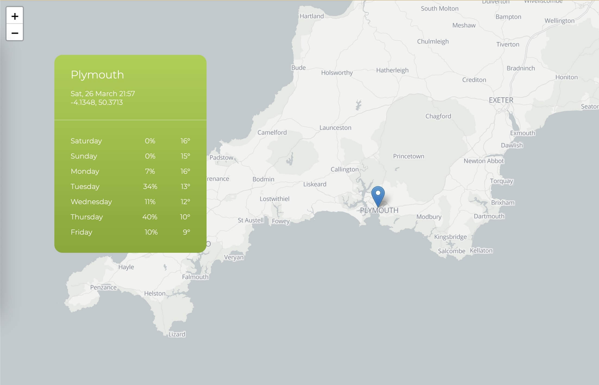

# spot-weather



To use the map tiles used in this project you will need to create a free account with stadiamaps.com and add the required domain name.
Or you can specify a different set of tiles in the LeafletMap.vue component

## Setting up the API keys

Go to the UK MetOffice Weather datahub website...
https://metoffice.apiconnect.ibmcloud.com/metoffice/production/

* Register an account
* Create an app
* Obtain the API ID and Secret
* Subscribe to a plan (free plans are available)

Add the ID and Secret to the terminal command below and then run it from the root directory of the project.

It will create a apikey.js file

```
echo -e "const X_IBM_CLIENT_ID ='';\nconst X_IBM_CLIENT_SECRET = '';\n\nexport { X_IBM_CLIENT_ID, X_IBM_CLIENT_SECRET };" > apikey.js
```


## Project setup
```
npm install
```

### Compiles and hot-reloads for development
```
npm run serve
```

### Compiles and minifies for production
```
npm run build
```

### Lints and fixes files
```
npm run lint
```

### Customize configuration
See [Configuration Reference](https://cli.vuejs.org/config/).
